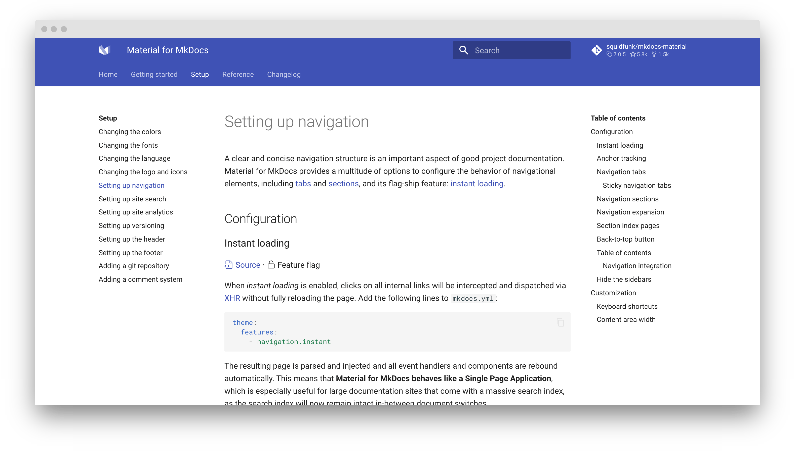
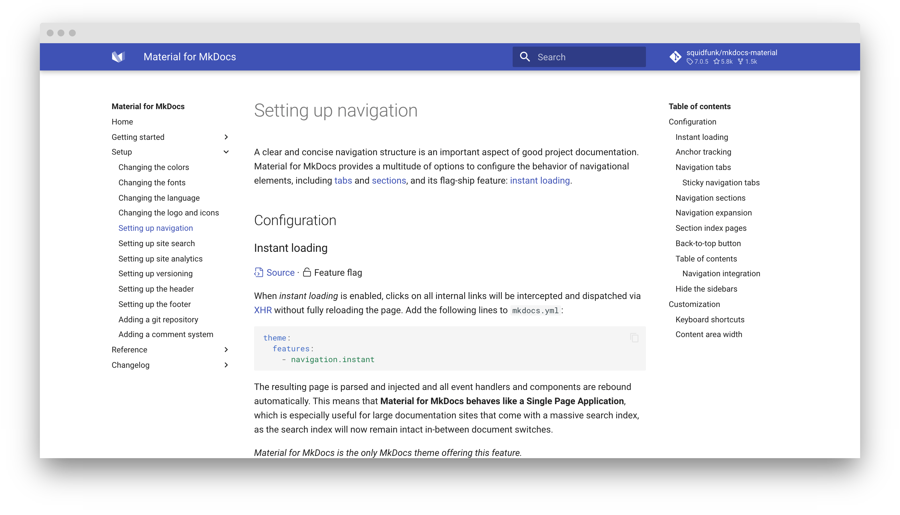

## **开启tab**

[导航方式配置](https://squidfunk.github.io/mkdocs-material/setup/setting-up-navigation/)

---

```yaml
theme:
  name: material
  feature:
    tabs: true
```



## **关闭tab**

---

```yaml
theme:
  name: material
  feature:
    tabs: false
```


