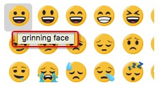

通过在markdown里使用 *:短名:*，可以在渲染出的html里展现emoji图片

依赖模块: pymdownx.emoji

使用步骤:

1. mkdocs.yml里配置:

    ```yaml
    - pymdownx.emoji:
        emoji_generator: !!python/name:pymdownx.emoji.to_png
    ```

	建议使用to_png，如果使用to_svg会有部分图片因为未付费导致无法显示

2. 浏览器打开[https://www.emojicopy.com/](https://www.emojicopy.com/)(emojione官方推出的emoji查询网站，虽然并非全部emoji，但也是目前找到的相对最全，并且分类清楚，使用方便的emoji查询网站)，将鼠标悬停在图标上方一会，会出现对应的全名，比如

	

3. 记录下这个全名，比如这里叫做grinning face

4. 点击进入附录里的[emojione全名短名映射表](./../../appendix/emoji_shortname/)，在里面查找对应的短名

5. 在markdown里使用该短名

!!! note "最省事做法: 直接复制emoji图标"
	无需mkdocs.yml做任何配置，只要是emoji图标(是图标不是图片)，无论是输入法自带的emoji图标，还是[https://www.emojicopy.com/](https://www.emojicopy.com/)上的emoji图标，都可以直接复制粘贴到markdown文档里即可。比如这个笑脸😄就来自我的输入法，可以自行复制到markdown文档里测试。

	而且这种方式适用于所有markdown编辑器。
